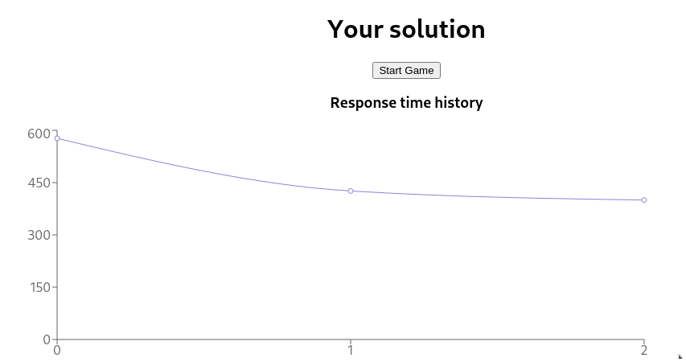
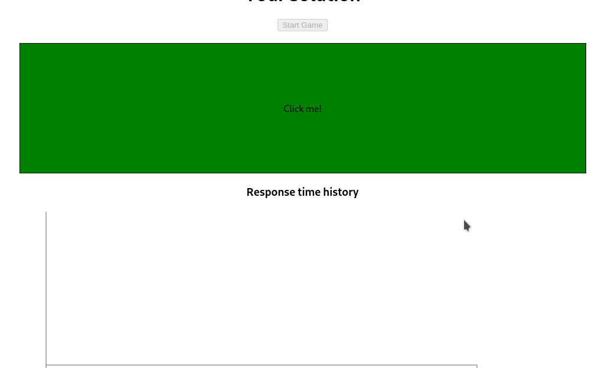

## Mission
**Use hooks instead of class components!**

Create a reaction time game.

### The Game
When user clicks the [**Start Game**] button, a black box should appear, and the [**Start Game**] button should be disabled (unclickable).

At a random moment, in the next 10 seconds, the box should change it's color from black to green, and display text: *Click me!*.

Finally, When user clicks on the green box, calculate the reaction time and display it to the user.

### Reaction time chart
Save all reaction times and display with a chart.
Use `react-recharts` library to render the chart.

Check out the documentation for [LineChart](https://recharts.org/en-US/examples/SimpleLineChart) component.
Customize the chart however you want.

