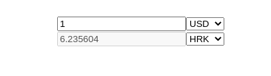

## Mission
**Use hooks instead of class components!**

in `data.tsx` there is 2 exported variables:
* **currencyUSDRates** is an object containing conversion rates for every currency. Base currency is USD.
* **currencies** is an array containing currency codes
### (1/2) Create a `CurrencyConverter` component in which you can enter an amount, currency, and currency to convert to.

User should be able to select currencies to convert from/to, and enter the amount to convert.
The second input should be disabled. (`<input disabled />`)




### (2/2) Create a `CurrencySelect` component.
This component renders a `<select>` element with currencies as options 
e.g (`<option key={"HRK"}> "HRK" </option>`)


`CurrencySelect` component should accept three props:
* `value` prop defines the currently selected currency.
* `onChange` prop is a callback function, which will be called once the user changes the currency selection.
* `currencies` prop is an array of currencies that user can select from

`CurrencySelect` should be controlled by the parent component (`CurrencyConverter`)


`data.tsx`
```JS
Object.entries(currencyUSDRates).map(([currency, rate]) => { <option/> })
```


## Steps
1. Create a `CurrencyConverter` component in file `exercise/CurrencyConverter.tsx`
2. Create a `CurrencySelect` component in file `exercise/CurrencySelect.tsx`.
3. Use `CurrencySelect` component in the `CurrencyConverter` component.
4. Render `CurrencyConverter` in `exercise/App.tsx`
